# Komatsu AHS System Architecture Diagrams

**Project**: Komatsu Autonomous Haulage System (AHS) Streaming Platform  
**Date**: December 2, 2025

This document contains comprehensive diagrams documenting the system architecture, data flows, and component interactions.

---

## Table of Contents

1. [High-Level System Architecture](#1-high-level-system-architecture)
2. [Telemetry Data Flow Sequence](#2-telemetry-data-flow-sequence)
3. [Fleet Management Sequence](#3-fleet-management-sequence)
4. [Alert Processing Sequence](#4-alert-processing-sequence)
5. [Vehicle State Machine](#5-vehicle-state-machine)
6. [Class Diagrams](#6-class-diagrams)
7. [Infrastructure Deployment](#7-infrastructure-deployment)
8. [Kafka Topics and Partitions](#8-kafka-topics-and-partitions)
9. [Flink Processing Pipeline](#9-flink-processing-pipeline)
10. [Component Interaction](#10-component-interaction)

---

## 1. High-Level System Architecture

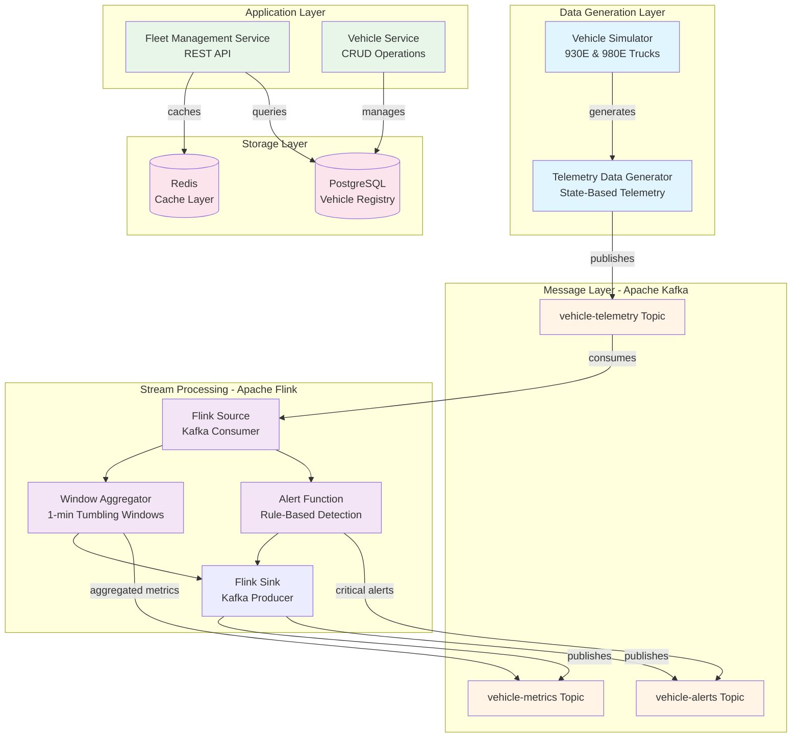
```mermaid
graph TB
    subgraph "Data Generation Layer"
        VG[Vehicle Simulator<br/>930E & 980E Trucks]
        TDG[Telemetry Data Generator<br/>State-Based Telemetry]
    end
    
    subgraph "Message Layer - Apache Kafka"
        KT1[vehicle-telemetry Topic]
        KT2[vehicle-alerts Topic]
        KT3[vehicle-metrics Topic]
    end
    
    subgraph "Stream Processing - Apache Flink"
        FS[Flink Source<br/>Kafka Consumer]
        AF[Alert Function<br/>Rule-Based Detection]
        WA[Window Aggregator<br/>1-min Tumbling Windows]
        FK[Flink Sink<br/>Kafka Producer]
    end
    
    subgraph "Application Layer"
        FM[Fleet Management Service<br/>REST API]
        VS[Vehicle Service<br/>CRUD Operations]
    end
    
    subgraph "Storage Layer"
        PG[(PostgreSQL<br/>Vehicle Registry)]
        RD[(Redis<br/>Cache Layer)]
    end
    
    VG -->|generates| TDG
    TDG -->|publishes| KT1
    KT1 -->|consumes| FS
    FS --> AF
    FS --> WA
    AF -->|critical alerts| KT2
    WA -->|aggregated metrics| KT3
    AF --> FK
    WA --> FK
    FK -->|publishes| KT2
    FK -->|publishes| KT3
    
    FM -->|queries| PG
    FM -->|caches| RD
    VS -->|manages| PG
    
    style VG fill:#e1f5ff
    style TDG fill:#e1f5ff
    style KT1 fill:#fff4e6
    style KT2 fill:#fff4e6
    style KT3 fill:#fff4e6
    style FS fill:#f3e5f5
    style AF fill:#f3e5f5
    style WA fill:#f3e5f5
    style FM fill:#e8f5e9
    style VS fill:#e8f5e9
    style PG fill:#fce4ec
    style RD fill:#fce4ec
```

---

## 2. Telemetry Data Flow Sequence

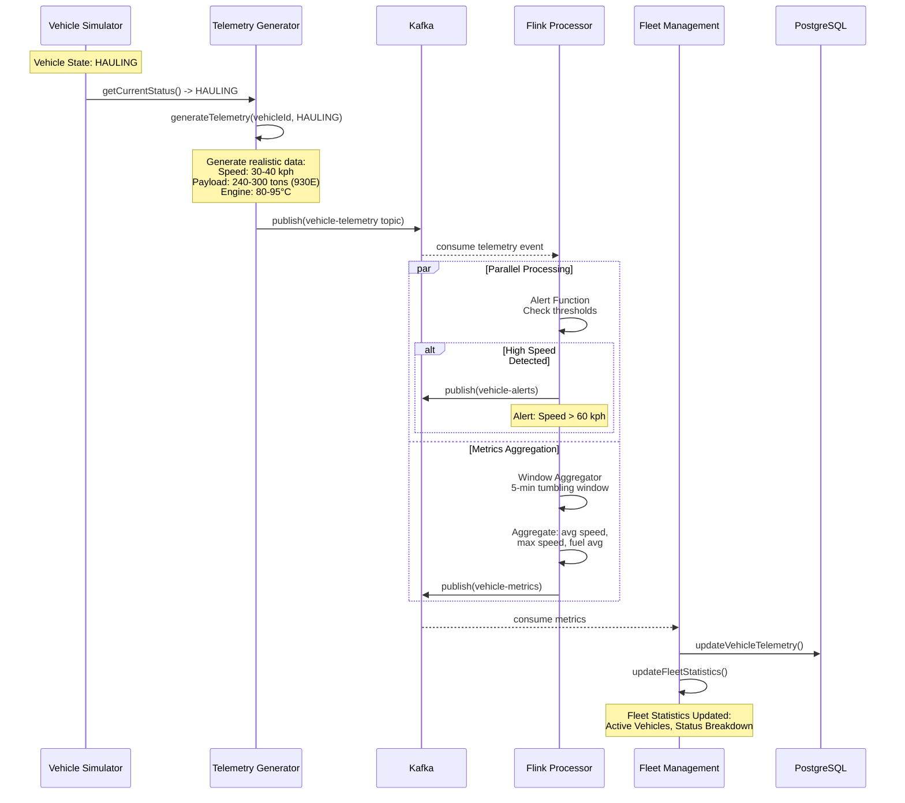
```mermaid
sequenceDiagram
    participant VS as Vehicle Simulator
    participant TDG as Telemetry Generator
    participant K as Kafka
    participant F as Flink Processor
    participant FM as Fleet Management
    participant DB as PostgreSQL
    
    Note over VS: Vehicle State: HAULING
    VS->>TDG: getCurrentStatus() -> HAULING
    TDG->>TDG: generateTelemetry(vehicleId, HAULING)
    
    Note over TDG: Generate realistic data:<br/>Speed: 30-40 kph<br/>Payload: 240-300 tons (930E)<br/>Engine: 80-95°C
    
    TDG->>K: publish(vehicle-telemetry topic)
    K-->>F: consume telemetry event
    
    par Parallel Processing
        F->>F: Alert Function<br/>Check thresholds
        alt High Speed Detected
            F->>K: publish(vehicle-alerts)
            Note over F: Alert: Speed > 60 kph
        end
    and Metrics Aggregation
        F->>F: Window Aggregator<br/>5-min tumbling window
        F->>F: Aggregate: avg speed,<br/>max speed, fuel avg
        F->>K: publish(vehicle-metrics)
    end
    
    K-->>FM: consume metrics
    FM->>DB: updateVehicleTelemetry()
    FM->>FM: updateFleetStatistics()
    
    Note over FM: Fleet Statistics Updated:<br/>Active Vehicles, Status Breakdown
```

---

## 3. Fleet Management Sequence

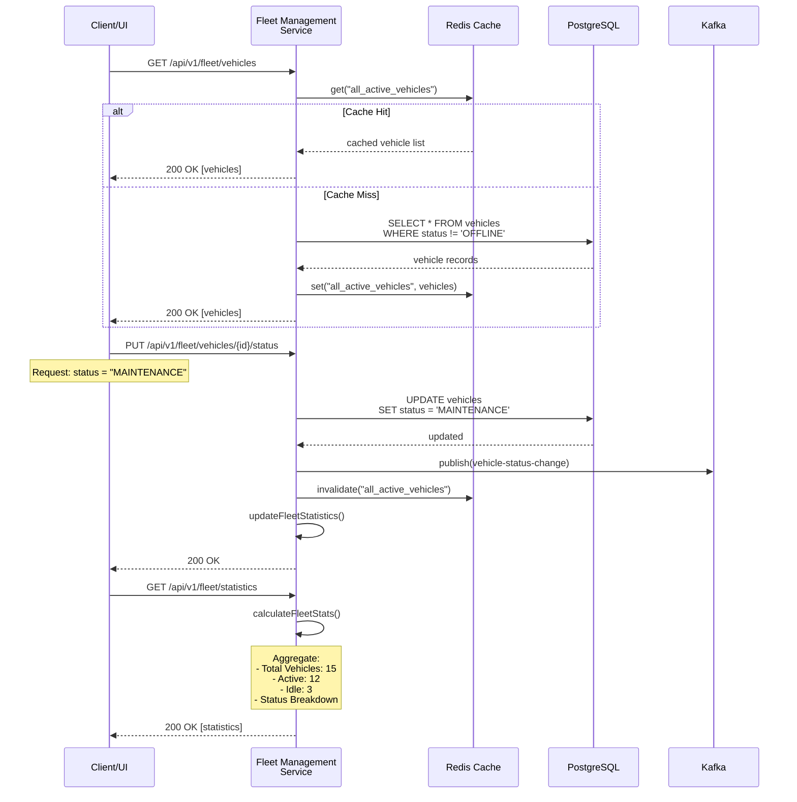
```mermaid
sequenceDiagram
    participant C as Client/UI
    participant FM as Fleet Management<br/>Service
    participant Cache as Redis Cache
    participant DB as PostgreSQL
    participant K as Kafka
    
    C->>FM: GET /api/v1/fleet/vehicles
    FM->>Cache: get("all_active_vehicles")
    
    alt Cache Hit
        Cache-->>FM: cached vehicle list
        FM-->>C: 200 OK [vehicles]
    else Cache Miss
        FM->>DB: SELECT * FROM vehicles<br/>WHERE status != 'OFFLINE'
        DB-->>FM: vehicle records
        FM->>Cache: set("all_active_vehicles", vehicles)
        FM-->>C: 200 OK [vehicles]
    end
    
    C->>FM: PUT /api/v1/fleet/vehicles/{id}/status
    Note over C: Request: status = "MAINTENANCE"
    
    FM->>DB: UPDATE vehicles<br/>SET status = 'MAINTENANCE'
    DB-->>FM: updated
    
    FM->>K: publish(vehicle-status-change)
    FM->>Cache: invalidate("all_active_vehicles")
    FM->>FM: updateFleetStatistics()
    
    FM-->>C: 200 OK
    
    C->>FM: GET /api/v1/fleet/statistics
    FM->>FM: calculateFleetStats()
    Note over FM: Aggregate:<br/>- Total Vehicles: 15<br/>- Active: 12<br/>- Idle: 3<br/>- Status Breakdown
    FM-->>C: 200 OK [statistics]
```

---

## 4. Alert Processing Sequence

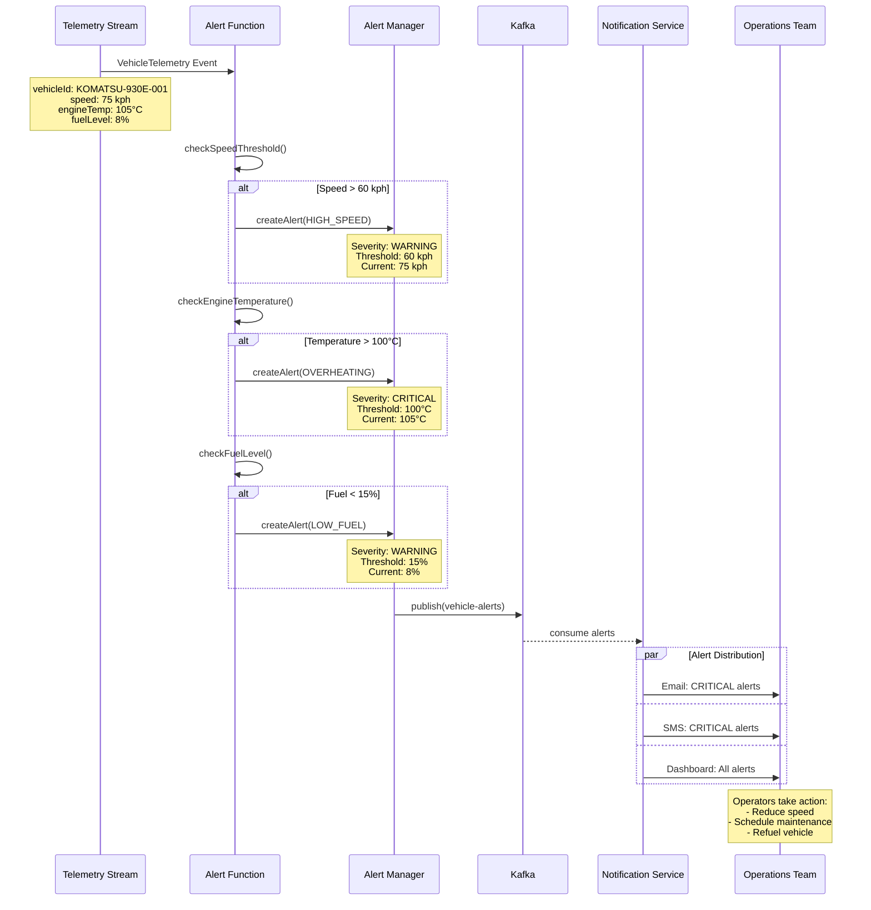
```mermaid
sequenceDiagram
    participant T as Telemetry Stream
    participant AF as Alert Function
    participant AM as Alert Manager
    participant K as Kafka
    participant N as Notification Service
    participant OP as Operations Team
    
    T->>AF: VehicleTelemetry Event
    Note over T: vehicleId: KOMATSU-930E-001<br/>speed: 75 kph<br/>engineTemp: 105°C<br/>fuelLevel: 8%
    
    AF->>AF: checkSpeedThreshold()
    alt Speed > 60 kph
        AF->>AM: createAlert(HIGH_SPEED)
        Note over AM: Severity: WARNING<br/>Threshold: 60 kph<br/>Current: 75 kph
    end
    
    AF->>AF: checkEngineTemperature()
    alt Temperature > 100°C
        AF->>AM: createAlert(OVERHEATING)
        Note over AM: Severity: CRITICAL<br/>Threshold: 100°C<br/>Current: 105°C
    end
    
    AF->>AF: checkFuelLevel()
    alt Fuel < 15%
        AF->>AM: createAlert(LOW_FUEL)
        Note over AM: Severity: WARNING<br/>Threshold: 15%<br/>Current: 8%
    end
    
    AM->>K: publish(vehicle-alerts)
    K-->>N: consume alerts
    
    par Alert Distribution
        N->>OP: Email: CRITICAL alerts
        and
        N->>OP: SMS: CRITICAL alerts
        and
        N->>OP: Dashboard: All alerts
    end
    
    Note over OP: Operators take action:<br/>- Reduce speed<br/>- Schedule maintenance<br/>- Refuel vehicle
```

---

## 5. Vehicle State Machine

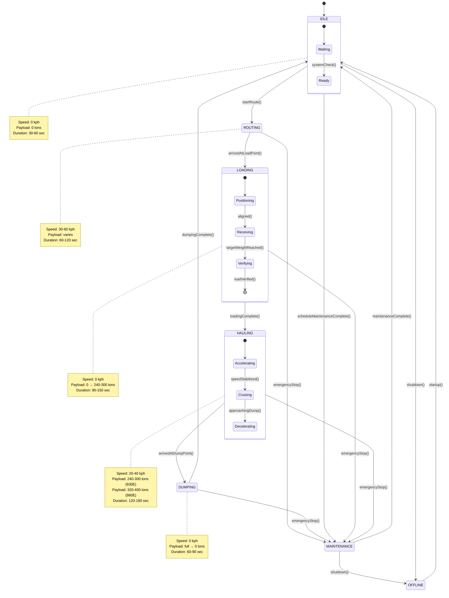
```mermaid
stateDiagram-v2
    [*] --> IDLE
    
    IDLE --> ROUTING : startRoute()
    ROUTING --> LOADING : arrivedAtLoadPoint()
    LOADING --> HAULING : loadingComplete()
    HAULING --> DUMPING : arrivedAtDumpPoint()
    DUMPING --> IDLE : dumpingComplete()
    
    IDLE --> MAINTENANCE : scheduleMaintenanceComplete()
    ROUTING --> MAINTENANCE : emergencyStop()
    LOADING --> MAINTENANCE : emergencyStop()
    HAULING --> MAINTENANCE : emergencyStop()
    DUMPING --> MAINTENANCE : emergencyStop()
    
    MAINTENANCE --> IDLE : maintenanceComplete()
    
    IDLE --> OFFLINE : shutdown()
    MAINTENANCE --> OFFLINE : shutdown()
    OFFLINE --> IDLE : startup()
    
    state IDLE {
        [*] --> Waiting
        Waiting --> Ready : systemCheck()
    }
    
    state HAULING {
        [*] --> Accelerating
        Accelerating --> Cruising : speedStabilized()
        Cruising --> Decelerating : approachingDump()
    }
    
    state LOADING {
        [*] --> Positioning
        Positioning --> Receiving : aligned()
        Receiving --> Verifying : targetWeightReached()
        Verifying --> [*] : loadVerified()
    }
    
    note right of IDLE
        Speed: 0 kph
        Payload: 0 tons
        Duration: 30-60 sec
    end note
    
    note right of ROUTING
        Speed: 30-60 kph
        Payload: varies
        Duration: 60-120 sec
    end note
    
    note right of LOADING
        Speed: 0 kph
        Payload: 0 → 240-300 tons
        Duration: 90-150 sec
    end note
    
    note right of HAULING
        Speed: 20-40 kph
        Payload: 240-300 tons (930E)
        Payload: 320-400 tons (980E)
        Duration: 120-180 sec
    end note
    
    note right of DUMPING
        Speed: 0 kph
        Payload: full → 0 tons
        Duration: 60-90 sec
    end note
```

---

## 6. Class Diagrams

### 6.1 Domain Model Classes

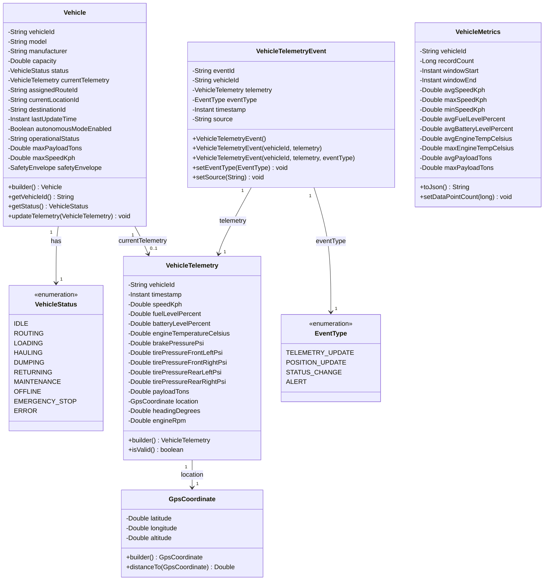
```mermaid
classDiagram
    class Vehicle {
        -String vehicleId
        -String model
        -String manufacturer
        -Double capacity
        -VehicleStatus status
        -VehicleTelemetry currentTelemetry
        -String assignedRouteId
        -String currentLocationId
        -String destinationId
        -Instant lastUpdateTime
        -Boolean autonomousModeEnabled
        -String operationalStatus
        -Double maxPayloadTons
        -Double maxSpeedKph
        -SafetyEnvelope safetyEnvelope
        +builder() Vehicle
        +getVehicleId() String
        +getStatus() VehicleStatus
        +updateTelemetry(VehicleTelemetry) void
    }
    
    class VehicleStatus {
        <<enumeration>>
        IDLE
        ROUTING
        LOADING
        HAULING
        DUMPING
        RETURNING
        MAINTENANCE
        OFFLINE
        EMERGENCY_STOP
        ERROR
    }
    
    class VehicleTelemetry {
        -String vehicleId
        -Instant timestamp
        -Double speedKph
        -Double fuelLevelPercent
        -Double batteryLevelPercent
        -Double engineTemperatureCelsius
        -Double brakePressurePsi
        -Double tirePressureFrontLeftPsi
        -Double tirePressureFrontRightPsi
        -Double tirePressureRearLeftPsi
        -Double tirePressureRearRightPsi
        -Double payloadTons
        -GpsCoordinate location
        -Double headingDegrees
        -Double engineRpm
        +builder() VehicleTelemetry
        +isValid() boolean
    }
    
    class GpsCoordinate {
        -Double latitude
        -Double longitude
        -Double altitude
        +builder() GpsCoordinate
        +distanceTo(GpsCoordinate) Double
    }
    
    class VehicleTelemetryEvent {
        -String eventId
        -String vehicleId
        -VehicleTelemetry telemetry
        -EventType eventType
        -Instant timestamp
        -String source
        +VehicleTelemetryEvent()
        +VehicleTelemetryEvent(vehicleId, telemetry)
        +VehicleTelemetryEvent(vehicleId, telemetry, eventType)
        +setEventType(EventType) void
        +setSource(String) void
    }
    
    class EventType {
        <<enumeration>>
        TELEMETRY_UPDATE
        POSITION_UPDATE
        STATUS_CHANGE
        ALERT
    }
    
    class VehicleMetrics {
        -String vehicleId
        -Long recordCount
        -Instant windowStart
        -Instant windowEnd
        -Double avgSpeedKph
        -Double maxSpeedKph
        -Double minSpeedKph
        -Double avgFuelLevelPercent
        -Double avgBatteryLevelPercent
        -Double avgEngineTempCelsius
        -Double maxEngineTempCelsius
        -Double avgPayloadTons
        -Double maxPayloadTons
        +toJson() String
        +setDataPointCount(long) void
    }
    
    Vehicle "1" --> "1" VehicleStatus : has
    Vehicle "1" --> "0..1" VehicleTelemetry : currentTelemetry
    VehicleTelemetry "1" --> "1" GpsCoordinate : location
    VehicleTelemetryEvent "1" --> "1" VehicleTelemetry : telemetry
    VehicleTelemetryEvent "1" --> "1" EventType : eventType
```

### 6.2 Service Layer Classes

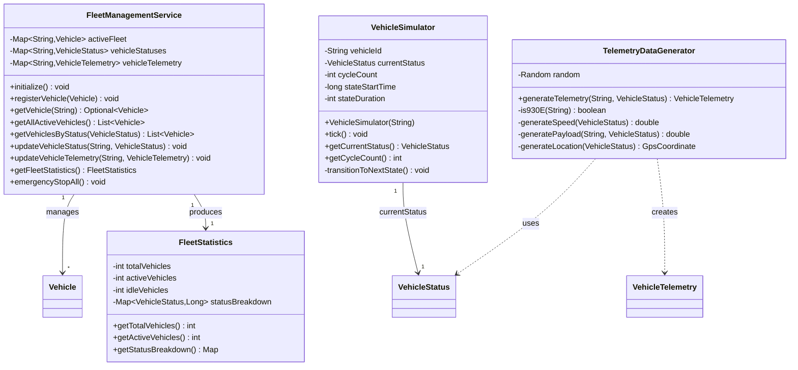
```mermaid
classDiagram
    class FleetManagementService {
        -Map~String,Vehicle~ activeFleet
        -Map~String,VehicleStatus~ vehicleStatuses
        -Map~String,VehicleTelemetry~ vehicleTelemetry
        +initialize() void
        +registerVehicle(Vehicle) void
        +getVehicle(String) Optional~Vehicle~
        +getAllActiveVehicles() List~Vehicle~
        +getVehiclesByStatus(VehicleStatus) List~Vehicle~
        +updateVehicleStatus(String, VehicleStatus) void
        +updateVehicleTelemetry(String, VehicleTelemetry) void
        +getFleetStatistics() FleetStatistics
        +emergencyStopAll() void
    }
    
    class FleetStatistics {
        -int totalVehicles
        -int activeVehicles
        -int idleVehicles
        -Map~VehicleStatus,Long~ statusBreakdown
        +getTotalVehicles() int
        +getActiveVehicles() int
        +getStatusBreakdown() Map
    }
    
    class VehicleSimulator {
        -String vehicleId
        -VehicleStatus currentStatus
        -int cycleCount
        -long stateStartTime
        -int stateDuration
        +VehicleSimulator(String)
        +tick() void
        +getCurrentStatus() VehicleStatus
        +getCycleCount() int
        -transitionToNextState() void
    }
    
    class TelemetryDataGenerator {
        -Random random
        +generateTelemetry(String, VehicleStatus) VehicleTelemetry
        -is930E(String) boolean
        -generateSpeed(VehicleStatus) double
        -generatePayload(String, VehicleStatus) double
        -generateLocation(VehicleStatus) GpsCoordinate
    }
    
    FleetManagementService "1" --> "*" Vehicle : manages
    FleetManagementService "1" --> "1" FleetStatistics : produces
    VehicleSimulator "1" --> "1" VehicleStatus : currentStatus
    TelemetryDataGenerator ..> VehicleTelemetry : creates
    TelemetryDataGenerator ..> VehicleStatus : uses
```

### 6.3 Flink Processing Classes

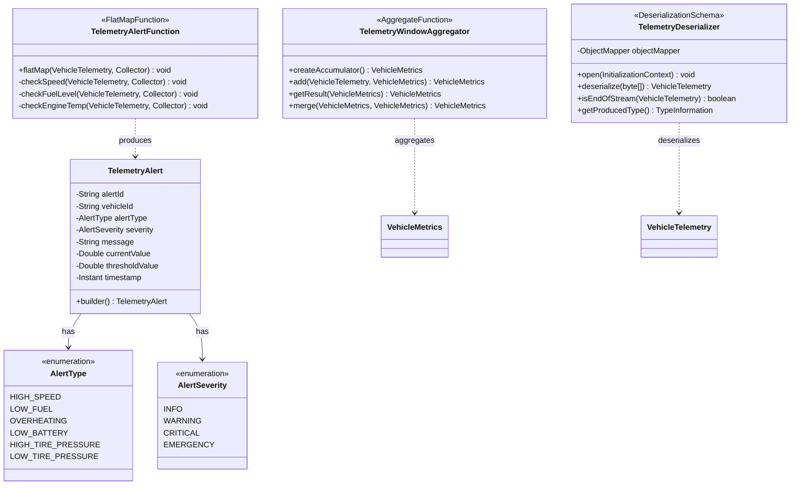
```mermaid
classDiagram
    class TelemetryAlertFunction {
        <<FlatMapFunction>>
        +flatMap(VehicleTelemetry, Collector) void
        -checkSpeed(VehicleTelemetry, Collector) void
        -checkFuelLevel(VehicleTelemetry, Collector) void
        -checkEngineTemp(VehicleTelemetry, Collector) void
    }
    
    class TelemetryAlert {
        -String alertId
        -String vehicleId
        -AlertType alertType
        -AlertSeverity severity
        -String message
        -Double currentValue
        -Double thresholdValue
        -Instant timestamp
        +builder() TelemetryAlert
    }
    
    class AlertType {
        <<enumeration>>
        HIGH_SPEED
        LOW_FUEL
        OVERHEATING
        LOW_BATTERY
        HIGH_TIRE_PRESSURE
        LOW_TIRE_PRESSURE
    }
    
    class AlertSeverity {
        <<enumeration>>
        INFO
        WARNING
        CRITICAL
        EMERGENCY
    }
    
    class TelemetryWindowAggregator {
        <<AggregateFunction>>
        +createAccumulator() VehicleMetrics
        +add(VehicleTelemetry, VehicleMetrics) VehicleMetrics
        +getResult(VehicleMetrics) VehicleMetrics
        +merge(VehicleMetrics, VehicleMetrics) VehicleMetrics
    }
    
    class TelemetryDeserializer {
        <<DeserializationSchema>>
        -ObjectMapper objectMapper
        +open(InitializationContext) void
        +deserialize(byte[]) VehicleTelemetry
        +isEndOfStream(VehicleTelemetry) boolean
        +getProducedType() TypeInformation
    }
    
    TelemetryAlertFunction ..> TelemetryAlert : produces
    TelemetryAlert --> AlertType : has
    TelemetryAlert --> AlertSeverity : has
    TelemetryWindowAggregator ..> VehicleMetrics : aggregates
    TelemetryDeserializer ..> VehicleTelemetry : deserializes
```

---

## 7. Infrastructure Deployment

### 7.1 Docker Compose Architecture

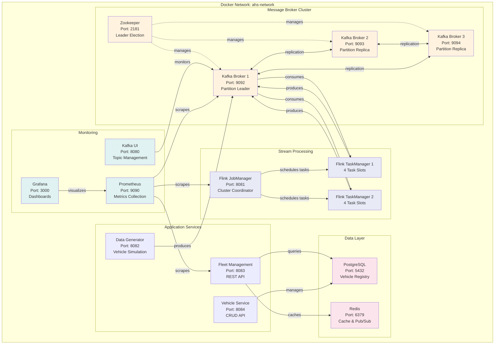
```mermaid
graph TB
    subgraph "Docker Network: ahs-network"
        subgraph "Message Broker Cluster"
            ZK[Zookeeper<br/>Port: 2181<br/>Leader Election]
            K1[Kafka Broker 1<br/>Port: 9092<br/>Partition Leader]
            K2[Kafka Broker 2<br/>Port: 9093<br/>Partition Replica]
            K3[Kafka Broker 3<br/>Port: 9094<br/>Partition Replica]
        end
        
        subgraph "Stream Processing"
            JM[Flink JobManager<br/>Port: 8081<br/>Cluster Coordinator]
            TM1[Flink TaskManager 1<br/>4 Task Slots]
            TM2[Flink TaskManager 2<br/>4 Task Slots]
        end
        
        subgraph "Data Layer"
            PG[PostgreSQL<br/>Port: 5432<br/>Vehicle Registry]
            RD[Redis<br/>Port: 6379<br/>Cache & Pub/Sub]
        end
        
        subgraph "Monitoring"
            KU[Kafka UI<br/>Port: 8080<br/>Topic Management]
            PM[Prometheus<br/>Port: 9090<br/>Metrics Collection]
            GR[Grafana<br/>Port: 3000<br/>Dashboards]
        end
        
        subgraph "Application Services"
            DG[Data Generator<br/>Port: 8082<br/>Vehicle Simulation]
            FM[Fleet Management<br/>Port: 8083<br/>REST API]
            VS[Vehicle Service<br/>Port: 8084<br/>CRUD API]
        end
    end
    
    ZK -.->|manages| K1
    ZK -.->|manages| K2
    ZK -.->|manages| K3
    
    K1 <-->|replication| K2
    K2 <-->|replication| K3
    K1 <-->|replication| K3
    
    JM -->|schedules tasks| TM1
    JM -->|schedules tasks| TM2
    
    DG -->|produces| K1
    K1 -->|consumes| TM1
    K1 -->|consumes| TM2
    TM1 -->|produces| K1
    TM2 -->|produces| K1
    
    FM -->|queries| PG
    FM -->|caches| RD
    VS -->|manages| PG
    
    KU -->|monitors| K1
    PM -->|scrapes| K1
    PM -->|scrapes| JM
    PM -->|scrapes| FM
    GR -->|visualizes| PM
    
    style ZK fill:#fff3e0
    style K1 fill:#fff3e0
    style K2 fill:#fff3e0
    style K3 fill:#fff3e0
    style JM fill:#e8eaf6
    style TM1 fill:#e8eaf6
    style TM2 fill:#e8eaf6
    style PG fill:#fce4ec
    style RD fill:#fce4ec
    style KU fill:#e0f2f1
    style PM fill:#e0f2f1
    style GR fill:#e0f2f1
```

### 7.2 Kubernetes Deployment

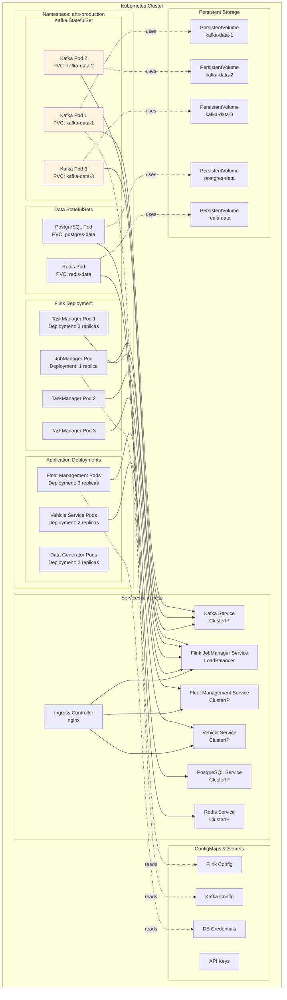
```mermaid
graph TB
    subgraph "Kubernetes Cluster"
        subgraph "Namespace: ahs-production"
            subgraph "Kafka StatefulSet"
                KP1[Kafka Pod 1<br/>PVC: kafka-data-1]
                KP2[Kafka Pod 2<br/>PVC: kafka-data-2]
                KP3[Kafka Pod 3<br/>PVC: kafka-data-3]
            end
            
            subgraph "Flink Deployment"
                JMP[JobManager Pod<br/>Deployment: 1 replica]
                TMP1[TaskManager Pod 1<br/>Deployment: 3 replicas]
                TMP2[TaskManager Pod 2]
                TMP3[TaskManager Pod 3]
            end
            
            subgraph "Application Deployments"
                DGP[Data Generator Pods<br/>Deployment: 2 replicas]
                FMP[Fleet Management Pods<br/>Deployment: 3 replicas]
                VSP[Vehicle Service Pods<br/>Deployment: 2 replicas]
            end
            
            subgraph "Data StatefulSets"
                PGP[PostgreSQL Pod<br/>PVC: postgres-data]
                RDP[Redis Pod<br/>PVC: redis-data]
            end
        end
        
        subgraph "Services & Ingress"
            KS[Kafka Service<br/>ClusterIP]
            FJS[Flink JobManager Service<br/>LoadBalancer]
            FMS[Fleet Management Service<br/>ClusterIP]
            VSS[Vehicle Service<br/>ClusterIP]
            PGS[PostgreSQL Service<br/>ClusterIP]
            RDS[Redis Service<br/>ClusterIP]
            
            ING[Ingress Controller<br/>nginx]
        end
        
        subgraph "ConfigMaps & Secrets"
            CM1[Kafka Config]
            CM2[Flink Config]
            SEC1[DB Credentials]
            SEC2[API Keys]
        end
        
        subgraph "Persistent Storage"
            PV1[PersistentVolume<br/>kafka-data-1]
            PV2[PersistentVolume<br/>kafka-data-2]
            PV3[PersistentVolume<br/>kafka-data-3]
            PV4[PersistentVolume<br/>postgres-data]
            PV5[PersistentVolume<br/>redis-data]
        end
    end
    
    KP1 --> KS
    KP2 --> KS
    KP3 --> KS
    
    JMP --> FJS
    TMP1 --> FJS
    TMP2 --> FJS
    TMP3 --> FJS
    
    FMP --> FMS
    VSP --> VSS
    PGP --> PGS
    RDP --> RDS
    
    ING --> FMS
    ING --> VSS
    ING --> FJS
    
    KP1 -.->|uses| PV1
    KP2 -.->|uses| PV2
    KP3 -.->|uses| PV3
    PGP -.->|uses| PV4
    RDP -.->|uses| PV5
    
    JMP -.->|reads| CM2
    KP1 -.->|reads| CM1
    FMP -.->|reads| SEC1
    
    style KP1 fill:#fff3e0
    style KP2 fill:#fff3e0
    style KP3 fill:#fff3e0
    style JMP fill:#e8eaf6
    style TMP1 fill:#e8eaf6
    style TMP2 fill:#e8eaf6
    style TMP3 fill:#e8eaf6
```

### 7.3 AWS Cloud Architecture

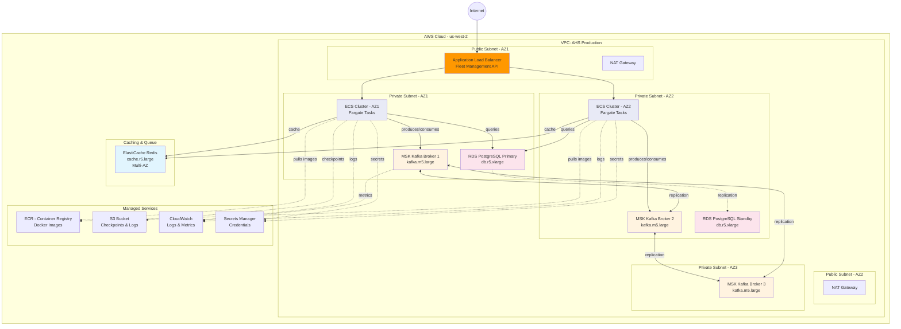
```mermaid
graph TB
    subgraph "AWS Cloud - us-west-2"
        subgraph "VPC: AHS Production"
            subgraph "Public Subnet - AZ1"
                ALB[Application Load Balancer<br/>Fleet Management API]
                NAT1[NAT Gateway]
            end
            
            subgraph "Public Subnet - AZ2"
                NAT2[NAT Gateway]
            end
            
            subgraph "Private Subnet - AZ1"
                ECS1[ECS Cluster - AZ1<br/>Fargate Tasks]
                MSK1[MSK Kafka Broker 1<br/>kafka.m5.large]
                RDS1[RDS PostgreSQL Primary<br/>db.r5.xlarge]
            end
            
            subgraph "Private Subnet - AZ2"
                ECS2[ECS Cluster - AZ2<br/>Fargate Tasks]
                MSK2[MSK Kafka Broker 2<br/>kafka.m5.large]
                RDS2[RDS PostgreSQL Standby<br/>db.r5.xlarge]
            end
            
            subgraph "Private Subnet - AZ3"
                MSK3[MSK Kafka Broker 3<br/>kafka.m5.large]
            end
        end
        
        subgraph "Managed Services"
            ECR[ECR - Container Registry<br/>Docker Images]
            S3[S3 Bucket<br/>Checkpoints & Logs]
            CW[CloudWatch<br/>Logs & Metrics]
            SM[Secrets Manager<br/>Credentials]
        end
        
        subgraph "Caching & Queue"
            EC[ElastiCache Redis<br/>cache.r5.large<br/>Multi-AZ]
        end
    end
    
    Internet((Internet)) --> ALB
    ALB --> ECS1
    ALB --> ECS2
    
    ECS1 -->|produces/consumes| MSK1
    ECS2 -->|produces/consumes| MSK2
    
    MSK1 <-->|replication| MSK2
    MSK2 <-->|replication| MSK3
    MSK1 <-->|replication| MSK3
    
    ECS1 -->|queries| RDS1
    ECS2 -->|queries| RDS1
    RDS1 -.->|replication| RDS2
    
    ECS1 -->|cache| EC
    ECS2 -->|cache| EC
    
    ECS1 -.->|pulls images| ECR
    ECS2 -.->|pulls images| ECR
    
    ECS1 -.->|logs| CW
    ECS2 -.->|logs| CW
    MSK1 -.->|metrics| CW
    
    ECS1 -.->|checkpoints| S3
    
    ECS1 -.->|secrets| SM
    ECS2 -.->|secrets| SM
    
    style ALB fill:#ff9800
    style MSK1 fill:#fff3e0
    style MSK2 fill:#fff3e0
    style MSK3 fill:#fff3e0
    style ECS1 fill:#e8eaf6
    style ECS2 fill:#e8eaf6
    style RDS1 fill:#fce4ec
    style RDS2 fill:#fce4ec
    style EC fill:#e1f5fe
```

---

## 8. Kafka Topics and Partitions

### 8.1 Topic Architecture

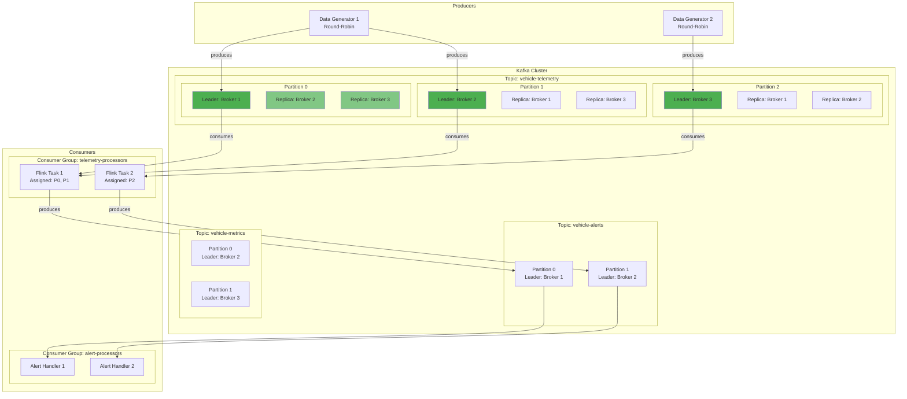
```mermaid
graph TB
    subgraph "Kafka Cluster"
        subgraph "Topic: vehicle-telemetry"
            subgraph "Partition 0"
                P0L[Leader: Broker 1]
                P0R1[Replica: Broker 2]
                P0R2[Replica: Broker 3]
            end
            
            subgraph "Partition 1"
                P1L[Leader: Broker 2]
                P1R1[Replica: Broker 1]
                P1R2[Replica: Broker 3]
            end
            
            subgraph "Partition 2"
                P2L[Leader: Broker 3]
                P2R1[Replica: Broker 1]
                P2R2[Replica: Broker 2]
            end
        end
        
        subgraph "Topic: vehicle-alerts"
            AP0[Partition 0<br/>Leader: Broker 1]
            AP1[Partition 1<br/>Leader: Broker 2]
        end
        
        subgraph "Topic: vehicle-metrics"
            MP0[Partition 0<br/>Leader: Broker 2]
            MP1[Partition 1<br/>Leader: Broker 3]
        end
    end
    
    subgraph "Producers"
        DG1[Data Generator 1<br/>Round-Robin]
        DG2[Data Generator 2<br/>Round-Robin]
    end
    
    subgraph "Consumers"
        subgraph "Consumer Group: telemetry-processors"
            C1[Flink Task 1<br/>Assigned: P0, P1]
            C2[Flink Task 2<br/>Assigned: P2]
        end
        
        subgraph "Consumer Group: alert-processors"
            AC1[Alert Handler 1]
            AC2[Alert Handler 2]
        end
    end
    
    DG1 -->|produces| P0L
    DG1 -->|produces| P1L
    DG2 -->|produces| P2L
    
    P0L -->|consumes| C1
    P1L -->|consumes| C1
    P2L -->|consumes| C2
    
    C1 -->|produces| AP0
    C2 -->|produces| AP1
    
    AP0 --> AC1
    AP1 --> AC2
    
    style P0L fill:#4caf50
    style P1L fill:#4caf50
    style P2L fill:#4caf50
    style P0R1 fill:#81c784
    style P0R2 fill:#81c784
```

### 8.2 Message Flow with Partitioning

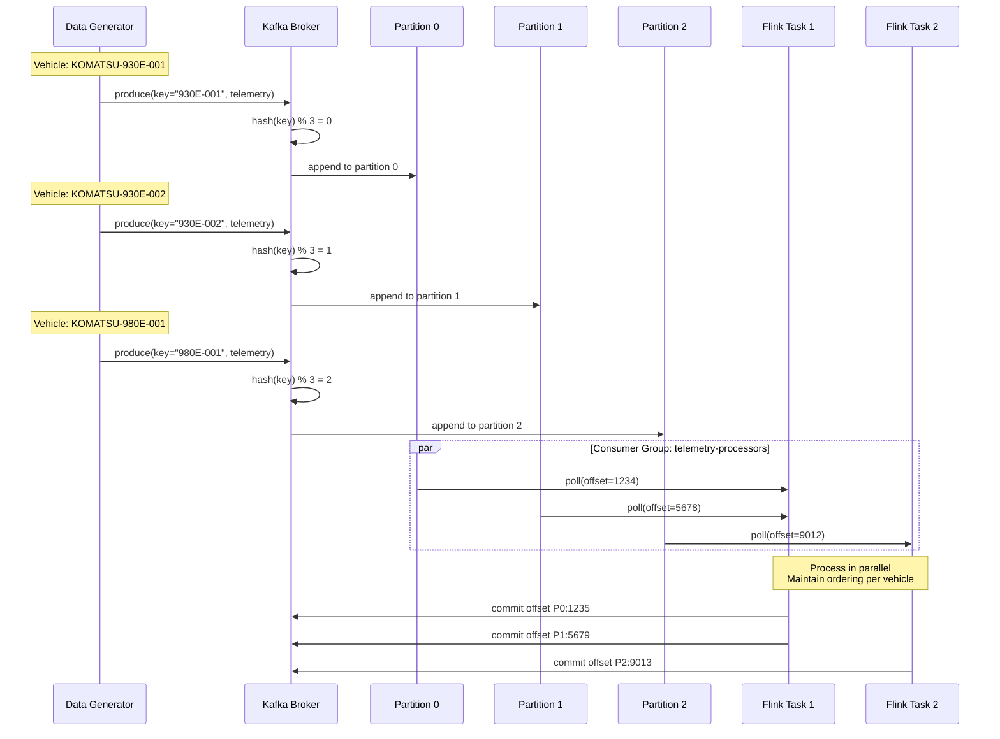
```mermaid
sequenceDiagram
    participant DG as Data Generator
    participant K as Kafka Broker
    participant P0 as Partition 0
    participant P1 as Partition 1
    participant P2 as Partition 2
    participant F1 as Flink Task 1
    participant F2 as Flink Task 2
    
    Note over DG: Vehicle: KOMATSU-930E-001
    DG->>K: produce(key="930E-001", telemetry)
    K->>K: hash(key) % 3 = 0
    K->>P0: append to partition 0
    
    Note over DG: Vehicle: KOMATSU-930E-002
    DG->>K: produce(key="930E-002", telemetry)
    K->>K: hash(key) % 3 = 1
    K->>P1: append to partition 1
    
    Note over DG: Vehicle: KOMATSU-980E-001
    DG->>K: produce(key="980E-001", telemetry)
    K->>K: hash(key) % 3 = 2
    K->>P2: append to partition 2
    
    par Consumer Group: telemetry-processors
        P0->>F1: poll(offset=1234)
        P1->>F1: poll(offset=5678)
        P2->>F2: poll(offset=9012)
    end
    
    Note over F1,F2: Process in parallel<br/>Maintain ordering per vehicle
    
    F1->>K: commit offset P0:1235
    F1->>K: commit offset P1:5679
    F2->>K: commit offset P2:9013
```

---

## 9. Flink Processing Pipeline

### 9.1 Detailed Processing Pipeline

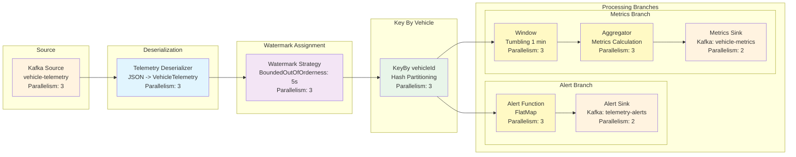
```mermaid
graph LR
    subgraph "Source"
        KS[Kafka Source<br/>vehicle-telemetry<br/>Parallelism: 3]
    end
    
    subgraph "Deserialization"
        DS[Telemetry Deserializer<br/>JSON -> VehicleTelemetry<br/>Parallelism: 3]
    end
    
    subgraph "Watermark Assignment"
        WM[Watermark Strategy<br/>BoundedOutOfOrderness: 5s<br/>Parallelism: 3]
    end
    
    subgraph "Key By Vehicle"
        KB[KeyBy vehicleId<br/>Hash Partitioning<br/>Parallelism: 3]
    end
    
    subgraph "Processing Branches"
        subgraph "Alert Branch"
            AF[Alert Function<br/>FlatMap<br/>Parallelism: 3]
            AK[Alert Sink<br/>Kafka: telemetry-alerts<br/>Parallelism: 2]
        end
        
        subgraph "Metrics Branch"
            WD[Window<br/>Tumbling 1 min<br/>Parallelism: 3]
            AG[Aggregator<br/>Metrics Calculation<br/>Parallelism: 3]
            MK[Metrics Sink<br/>Kafka: vehicle-metrics<br/>Parallelism: 2]
        end
    end
    
    KS --> DS
    DS --> WM
    WM --> KB
    KB --> AF
    KB --> WD
    
    AF --> AK
    WD --> AG
    AG --> MK
    
    style KS fill:#fff3e0
    style DS fill:#e1f5fe
    style WM fill:#f3e5f5
    style KB fill:#e8f5e9
    style AF fill:#fff9c4
    style WD fill:#fff9c4
    style AG fill:#fff9c4
    style AK fill:#fff3e0
    style MK fill:#fff3e0
```

### 9.2 Window Processing Detail

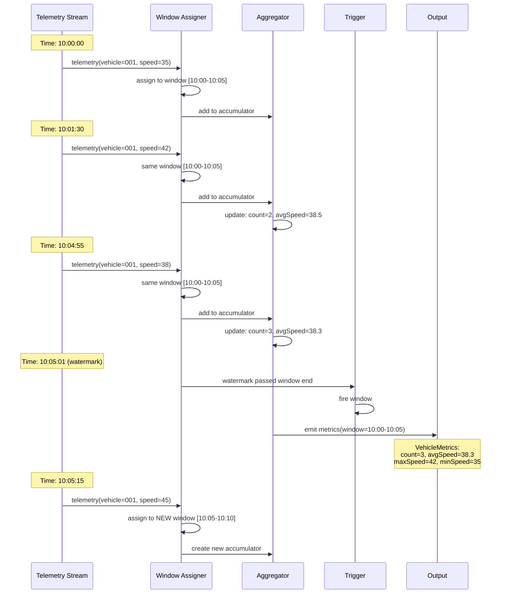
```mermaid
sequenceDiagram
    participant S as Telemetry Stream
    participant W as Window Assigner
    participant A as Aggregator
    participant T as Trigger
    participant O as Output
    
    Note over S: Time: 10:00:00
    S->>W: telemetry(vehicle=001, speed=35)
    W->>W: assign to window [10:00-10:05]
    W->>A: add to accumulator
    
    Note over S: Time: 10:01:30
    S->>W: telemetry(vehicle=001, speed=42)
    W->>W: same window [10:00-10:05]
    W->>A: add to accumulator
    A->>A: update: count=2, avgSpeed=38.5
    
    Note over S: Time: 10:04:55
    S->>W: telemetry(vehicle=001, speed=38)
    W->>W: same window [10:00-10:05]
    W->>A: add to accumulator
    A->>A: update: count=3, avgSpeed=38.3
    
    Note over S: Time: 10:05:01 (watermark)
    W->>T: watermark passed window end
    T->>T: fire window
    A->>O: emit metrics(window=10:00-10:05)
    
    Note over O: VehicleMetrics:<br/>count=3, avgSpeed=38.3<br/>maxSpeed=42, minSpeed=35
    
    Note over S: Time: 10:05:15
    S->>W: telemetry(vehicle=001, speed=45)
    W->>W: assign to NEW window [10:05-10:10]
    W->>A: create new accumulator
```

---

## 10. Component Interaction

### 10.1 Data Generator to Kafka Flow

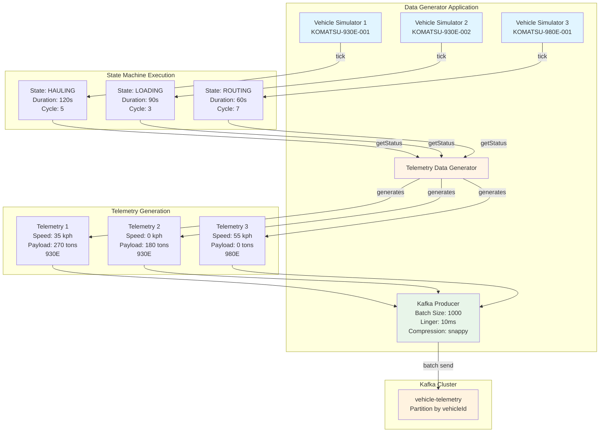
```mermaid
graph TB
    subgraph "Data Generator Application"
        VS1[Vehicle Simulator 1<br/>KOMATSU-930E-001]
        VS2[Vehicle Simulator 2<br/>KOMATSU-930E-002]
        VS3[Vehicle Simulator 3<br/>KOMATSU-980E-001]
        
        TDG[Telemetry Data Generator]
        
        KP[Kafka Producer<br/>Batch Size: 1000<br/>Linger: 10ms<br/>Compression: snappy]
    end
    
    subgraph "State Machine Execution"
        VS1 -->|tick| SM1[State: HAULING<br/>Duration: 120s<br/>Cycle: 5]
        VS2 -->|tick| SM2[State: LOADING<br/>Duration: 90s<br/>Cycle: 3]
        VS3 -->|tick| SM3[State: ROUTING<br/>Duration: 60s<br/>Cycle: 7]
    end
    
    SM1 -->|getStatus| TDG
    SM2 -->|getStatus| TDG
    SM3 -->|getStatus| TDG
    
    subgraph "Telemetry Generation"
        TDG -->|generates| T1[Telemetry 1<br/>Speed: 35 kph<br/>Payload: 270 tons<br/>930E]
        TDG -->|generates| T2[Telemetry 2<br/>Speed: 0 kph<br/>Payload: 180 tons<br/>930E]
        TDG -->|generates| T3[Telemetry 3<br/>Speed: 55 kph<br/>Payload: 0 tons<br/>980E]
    end
    
    T1 --> KP
    T2 --> KP
    T3 --> KP
    
    subgraph "Kafka Cluster"
        KP -->|batch send| KT[vehicle-telemetry<br/>Partition by vehicleId]
    end
    
    style VS1 fill:#e1f5ff
    style VS2 fill:#e1f5ff
    style VS3 fill:#e1f5ff
    style TDG fill:#fff4e6
    style KP fill:#e8f5e9
    style KT fill:#fff3e0
```

### 10.2 Complete Request-Response Flow

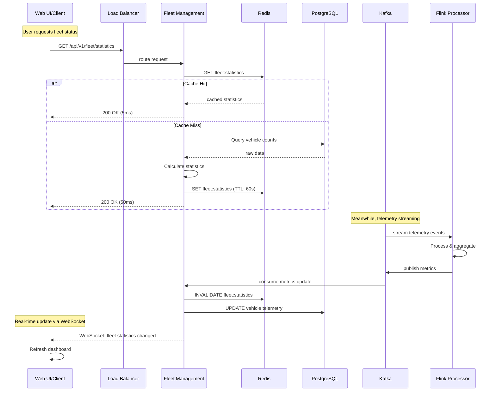
```mermaid
sequenceDiagram
    participant UI as Web UI/Client
    participant LB as Load Balancer
    participant FM as Fleet Management
    participant Cache as Redis
    participant DB as PostgreSQL
    participant K as Kafka
    participant F as Flink Processor
    
    Note over UI: User requests fleet status
    UI->>LB: GET /api/v1/fleet/statistics
    LB->>FM: route request
    
    FM->>Cache: GET fleet:statistics
    alt Cache Hit
        Cache-->>FM: cached statistics
        FM-->>UI: 200 OK (5ms)
    else Cache Miss
        FM->>DB: Query vehicle counts
        DB-->>FM: raw data
        FM->>FM: Calculate statistics
        FM->>Cache: SET fleet:statistics (TTL: 60s)
        FM-->>UI: 200 OK (50ms)
    end
    
    Note over K: Meanwhile, telemetry streaming
    K->>F: stream telemetry events
    F->>F: Process & aggregate
    F->>K: publish metrics
    K->>FM: consume metrics update
    FM->>Cache: INVALIDATE fleet:statistics
    FM->>DB: UPDATE vehicle telemetry
    
    Note over UI: Real-time update via WebSocket
    FM-->>UI: WebSocket: fleet statistics changed
    UI->>UI: Refresh dashboard
```

### 10.3 Error Handling and Recovery

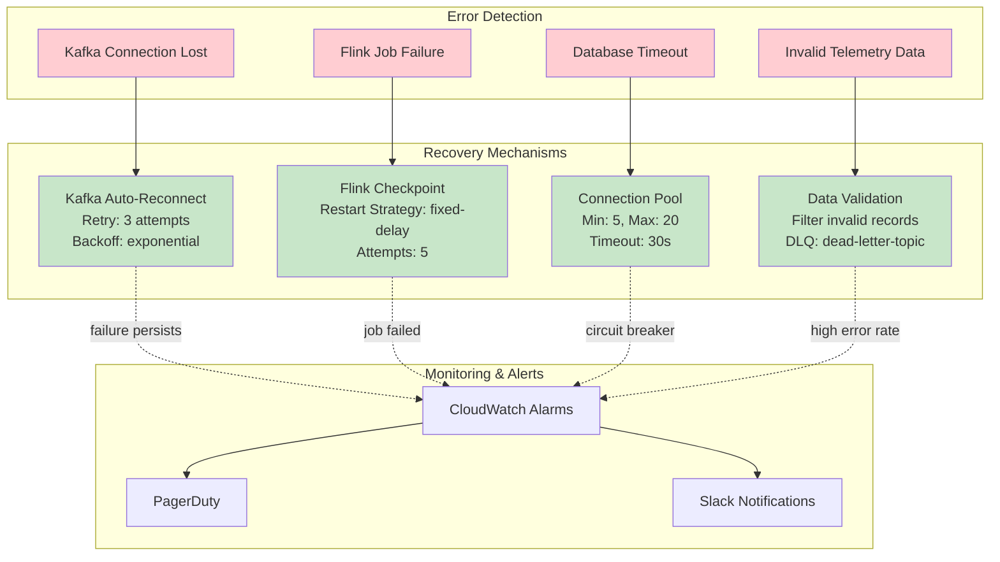
```mermaid
graph TB
    subgraph "Error Detection"
        E1[Kafka Connection Lost]
        E2[Flink Job Failure]
        E3[Database Timeout]
        E4[Invalid Telemetry Data]
    end
    
    subgraph "Recovery Mechanisms"
        R1[Kafka Auto-Reconnect<br/>Retry: 3 attempts<br/>Backoff: exponential]
        R2[Flink Checkpoint<br/>Restart Strategy: fixed-delay<br/>Attempts: 5]
        R3[Connection Pool<br/>Min: 5, Max: 20<br/>Timeout: 30s]
        R4[Data Validation<br/>Filter invalid records<br/>DLQ: dead-letter-topic]
    end
    
    subgraph "Monitoring & Alerts"
        M1[CloudWatch Alarms]
        M2[PagerDuty]
        M3[Slack Notifications]
    end
    
    E1 --> R1
    E2 --> R2
    E3 --> R3
    E4 --> R4
    
    R1 -.->|failure persists| M1
    R2 -.->|job failed| M1
    R3 -.->|circuit breaker| M1
    R4 -.->|high error rate| M1
    
    M1 --> M2
    M1 --> M3
    
    style E1 fill:#ffcdd2
    style E2 fill:#ffcdd2
    style E3 fill:#ffcdd2
    style E4 fill:#ffcdd2
    style R1 fill:#c8e6c9
    style R2 fill:#c8e6c9
    style R3 fill:#c8e6c9
    style R4 fill:#c8e6c9
```

---
