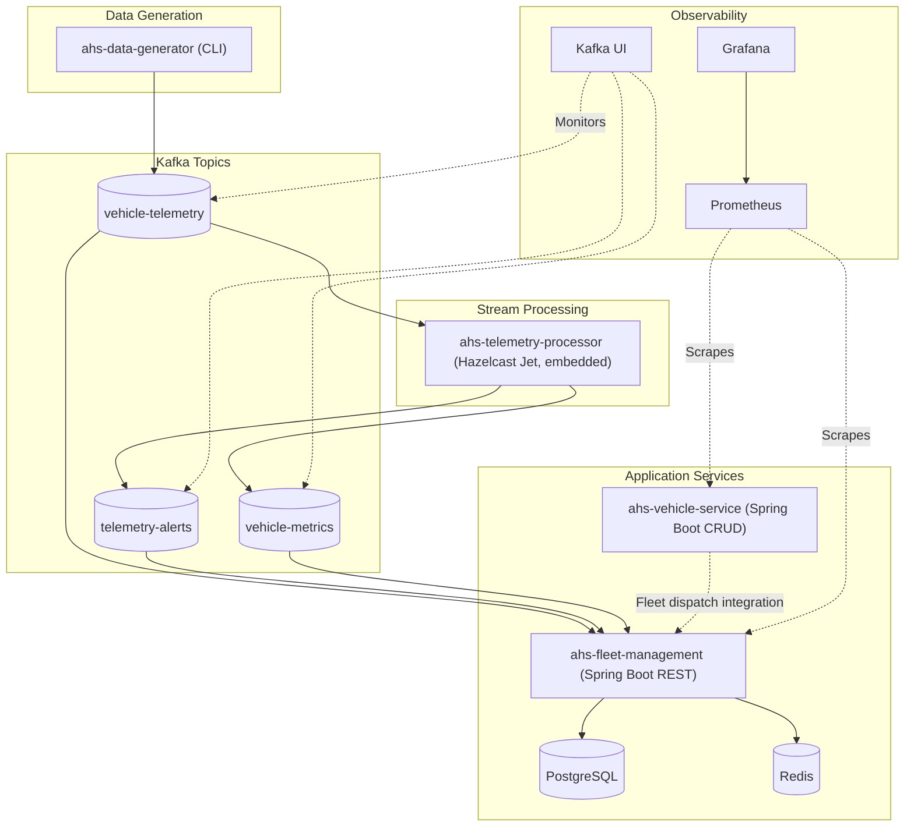
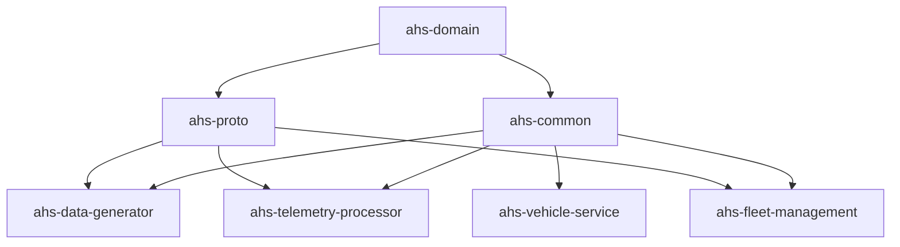

# Titan Autonomous Haulage System (AHS) Streaming Platform

A self-directed reference implementation of a real-time telemetry ingestion and fleet-management pipeline for the autonomous mining-truck domain, built with Apache Kafka, Spring Boot 3.2, and embedded Hazelcast Jet. This is a personal learning project developed to explore distributed event streaming and stream processing architectures.

> **About the vehicle data.** Titan and the Titan 300 / Titan 400 are fictional. Their payload classes, telemetry ranges, and duty cycle (idle → routing → loading → hauling → dumping) are loosely modeled on production 300- and 400-ton-class autonomous mining haul trucks. No real manufacturer's data, software, or trademarks are used.


## 🎯 Motivation

This project was built as a self-directed initiative to explore and master key distributed systems and stream-processing patterns:
- **Kafka topic/partition design and consumer groups**: Partitioning strategies by vehicle ID for strict sequential ordering, high-throughput ingest, and consumer group scaling.
- **Hazelcast Jet CEP and windowed aggregations**: In-memory complex event processing (CEP) for anomaly detection, stateful stream processing, and tumbling window aggregations.
- **Decoupled Spring Boot microservices**: Architecting clean, modular microservices communicating asynchronously over Kafka event streams with Spring Boot 3.2.
- **Containerized observability with Prometheus/Grafana**: End-to-end telemetry monitoring, custom actuator metric scraping, and pre-provisioned Grafana visualization.

---

## 📋 Table of Contents

- [Project Structure](#project-structure)
- [Prerequisites](#prerequisites)
- [Quick Start](#quick-start)
- [Docker Deployment (Full Stack)](#-docker-deployment-full-stack)
- [Grafana Dashboards](#-grafana-dashboards)
- [Running Locally (Development Mode)](#-running-locally-development-mode)
- [API Documentation](#api-documentation)
- [Configuration Guide](#configuration-guide)
- [Testing Scenarios](#testing-scenarios)
- [Production Considerations](#-production-considerations--what-i-deliberately-simplified)
- [Troubleshooting](#troubleshooting)

---

## 🏗️ Architecture Overview

### System Architecture



### Technology Stack

| Component | Technology | Purpose |
|-----------|-----------|---------|
| **Stream Processing** | Hazelcast Jet 5.6.0 (embedded) | Real-time telemetry processing, CEP, windowed aggregations |
| **Message Broker** | Apache Kafka 3.6.0 | Event streaming, decoupling services |
| **Backend Framework** | Spring Boot 3.2.0 | REST APIs, dependency injection, auto-configuration |
| **Serialization** | Jackson 2.16.0 | JSON processing for events and APIs |
| **Build Tool** | Gradle 8.4 | Multi-module build, dependency management |
| **Language** | Java 17 | All modules |

### Data Flow

1. **Generation**: Data generator simulates autonomous trucks publishing telemetry to Kafka (topic `vehicle-telemetry`)
2. **Ingestion**: Telemetry Processor (Hazelcast Jet, embedded) consumes telemetry from Kafka topic `vehicle-telemetry`
3. **Processing**:
   - CEP patterns detect anomalies (rapid deceleration, overheating, low fuel)
   - Windowed aggregations compute per-vehicle metrics every minute
4. **Output**: Alerts and metrics published to Kafka topics: `telemetry-alerts` and `vehicle-metrics`
5. **Consumption**: Fleet management service consumes telemetry events and updates vehicle state
   
Note: Fleet telemetry consumer topic is configured via `kafka.topics.vehicle-telemetry`.
- Local default: `ahs.telemetry.processed`
- Docker profile: `vehicle-telemetry`
6. **Exposure**: REST APIs provide access to fleet data for external systems

---

## 📁 Project Structure

```
ShuzAHS/
├── ahs-domain/                     # Core domain models and events
│   ├── model/                      # Vehicle, Location, Telemetry, etc.
│   └── events/                     # VehicleTelemetryEvent, VehicleCommandEvent, etc.
│
├── ahs-common/                     # Shared utilities and constants
│   └── util/                       # Common helper classes
│
├── ahs-proto/                      # Protocol Buffers definitions (proto3)
│   └── src/main/proto/             # telemetry.proto
│
├── ahs-data-generator/             # CLI data generator & LIDAR simulation
│   ├── generator/                  # TelemetryDataGenerator, VehicleSimulator
│   ├── lidar/                      # JME headless LIDAR ray-casting
│   └── kafka/                      # KafkaTelemetryProducer
│
├── ahs-telemetry-processor/        # Telemetry processor (Hazelcast Jet, embedded)
│   ├── function/                   # Deserializers, window aggregations, CEP alerts
│   └── model/                      # TelemetryAlert, VehicleMetrics
│
├── ahs-fleet-management/           # Fleet management REST API
│   ├── service/                    # FleetManagementService
│   ├── kafka/                      # Kafka consumers
│   └── controller/                 # REST controllers
│
└── ahs-vehicle-service/            # Vehicle CRUD service
    └── service/                    # Vehicle operations
```

### Module Dependencies



---

## 🔧 Prerequisites

### Required

- **Java 17**
  ```bash
  java -version
  # openjdk version "17.x"
  ```

- **Gradle 8.x** (wrapper included)
  ```bash
  ./gradlew --version
  ```

### Optional

- **Docker** & **Docker Compose** (for Kafka)
  ```bash
  docker --version
  docker-compose --version
  ```

### Infrastructure

- **Apache Kafka** (can run via Docker)
- **Apache Zookeeper** (for Kafka)

---

## ⚡ Quick Start

### Option A: Full Stack with Docker (Recommended)

```bash
# Clone the repository
cd ShuzAHS

# Build and start all 13 containers
./start.sh
```

This starts the complete platform with all services. See [Docker Deployment](#-docker-deployment-full-stack) for details.

### Option B: Manual Setup

#### 1. Build the Project

```bash
# Clone the repository
cd ShuzAHS

# Build all modules (skip tests for quick build)
./gradlew build -x test
```

Expected output:
```
BUILD SUCCESSFUL in 5s
28 actionable tasks: 28 executed
```

#### 2. Start Kafka (Docker)

Create `docker-compose.yml`:
```yaml
version: '3'
services:
  zookeeper:
    image: confluentinc/cp-zookeeper:7.5.0
    environment:
      ZOOKEEPER_CLIENT_PORT: 2181
    ports:
      - "2181:2181"

  kafka:
    image: confluentinc/cp-kafka:7.5.0
    depends_on:
      - zookeeper
    ports:
      - "9092:9092"
    environment:
      KAFKA_BROKER_ID: 1
      KAFKA_ZOOKEEPER_CONNECT: zookeeper:2181
      KAFKA_ADVERTISED_LISTENERS: PLAINTEXT://localhost:9092
      KAFKA_OFFSETS_TOPIC_REPLICATION_FACTOR: 1
```

Start Kafka:
```bash
docker-compose up -d
```

#### 3. Create Kafka Topics

```bash
# Create telemetry topic
docker exec -it $(docker ps -qf "name=kafka") kafka-topics \
  --create --bootstrap-server localhost:9092 \
  --topic vehicle-telemetry \
  --partitions 3 \
  --replication-factor 1

# Create alerts topic
docker exec -it $(docker ps -qf "name=kafka") kafka-topics \
  --create --bootstrap-server localhost:9092 \
  --topic telemetry-alerts \
  --partitions 3 \
  --replication-factor 1

# Create metrics topic
docker exec -it $(docker ps -qf "name=kafka") kafka-topics \
  --create --bootstrap-server localhost:9092 \
  --topic vehicle-metrics \
  --partitions 3 \
  --replication-factor 1
```

#### 4. Start Services

Open separate terminals for each service:

**Terminal 1 - Data Generator:**
```bash
./run-generator.sh
# OR with custom settings:
java -jar ahs-data-generator/build/libs/ahs-data-generator.jar -v 15 -i 5000
```

**Terminal 2 - Telemetry Processor:**
```bash
./gradlew :ahs-telemetry-processor:run
```

**Terminal 3 - Fleet Management:**
```bash
./gradlew :ahs-fleet-management:bootRun
```

**Terminal 4 - Vehicle Service:**
```bash
./gradlew :ahs-vehicle-service:bootRun
```

#### 5. Verify System is Running

```bash
# Check fleet statistics
curl http://localhost:8080/api/v1/fleet/statistics

# Watch Kafka topic
docker exec -it $(docker ps -qf "name=kafka") kafka-console-consumer \
  --bootstrap-server localhost:9092 \
  --topic vehicle-telemetry \
  --from-beginning \
  --max-messages 5
```

---

## 🐳 Docker Deployment (Full Stack)

### All 11 Containers

The complete platform runs **11 containers**:

| # | Container Name | Service | Port | Description |
|---|----------------|---------|------|-------------|
| **Infrastructure** |
| 1 | `ahs-zookeeper` | Zookeeper | 2181 | Kafka coordination |
| 2 | `ahs-kafka` | Kafka Broker | 9092 | Message streaming |
| 3 | `ahs-postgres` | PostgreSQL | 5432 | Vehicle registry DB |
| 4 | `ahs-redis` | Redis | 6379 | Cache & session store |
| **Web UIs** |
| 5 | `ahs-kafka-ui` | Kafka UI | 8080 | Kafka management interface |
| 6 | `ahs-prometheus-ui` | Prometheus | 9090 | Metrics collection |
| 7 | `ahs-grafana-ui` | Grafana | 3000 | Metrics visualization |
| **Application Services** |
| 8 | `ahs-data-generator` | Data Generator | 8082 | Vehicle simulation |
| 9 | `ahs-telemetry-processor` | Telemetry Processor (Hazelcast Jet, embedded) | - | Real-time stream processing |
| 10 | `ahs-fleet-management` | Fleet Management API | 8083 | Fleet operations |
| 11 | `ahs-vehicle-service` | Vehicle Service API | 8084 | Vehicle CRUD |

### Quick Start with Docker

**Option 1: Using start.sh (Recommended)**
```bash
# Build and start all containers
./start.sh
```

The script will:
1. ✅ Verify Docker is running
2. 📦 Build the project with Gradle
3. 🔍 Automatically detect port collisions and assign the next available port (saving to `.env`)
4. 🚀 Start all containers with active ports
5. 🔍 Verify each container status
6. 🌐 Display all active access points

> [!TIP]
> If a local service or container already occupies default ports (such as `9090` for Prometheus or `3000` for Grafana), `./start.sh` and `./resolve-ports.sh` automatically detect the conflict and allocate the next free port without failing. You can also customize ports manually in `.env` (see `.env.example`).

**Option 2: Manual Docker Compose**
```bash
# Build the project first
./gradlew build -x test

# Check ports and generate .env (optional if custom ports are needed)
./resolve-ports.sh

# Start all services
docker compose up -d

# Verify all containers are running
docker ps --format "table {{.Names}}\t{{.Status}}\t{{.Ports}}" | grep -E "ahs-"
```

### Web UI Access Points

| Service | URL | Credentials |
|---------|-----|-------------|
| Kafka UI | http://localhost:8080 | - |
| Prometheus | http://localhost:9090 | - |
| Grafana | http://localhost:3000 | admin / admin |
| Data Generator | http://localhost:8082 | - |
| Fleet Management API | http://localhost:8083 | - |
| Vehicle Service API | http://localhost:8084 | - |

> [!NOTE]
> The table lists default host ports. When starting with `./start.sh` (or `./resolve-ports.sh`), any port collisions on the host are automatically detected and resolved to the next free port, written to `.env`, and displayed in the startup summary.

### Container Management

```bash
# View all running containers
docker-compose ps

# View logs for all services
docker-compose logs -f

# View logs for specific service
docker-compose logs -f kafka-ui

# Stop all containers
docker-compose down

# Stop and remove volumes (clean reset)
docker-compose down -v
```

### Verify Container Health

```bash
# Count running AHS containers
docker ps --format '{{.Names}}' | grep -E "ahs-" | wc -l

# Check individual service health
curl http://localhost:8083/actuator/health  # Fleet Management
curl http://localhost:8084/actuator/health  # Vehicle Service
```

---

## 📊 Grafana Dashboards

This project ships with a pre-provisioned Grafana instance and dashboards for monitoring fleet metrics exported to Prometheus.

### Access

- URL: http://localhost:3000
- Credentials: `admin` / `admin` (you will be prompted to change on first login)

### How provisioning works

Grafana is configured to auto-load the Prometheus datasource and dashboards on startup. See the Docker Compose mounts:

```
./grafana/provisioning/datasources -> /etc/grafana/provisioning/datasources
./grafana/provisioning/dashboards  -> /etc/grafana/provisioning/dashboards
./grafana/dashboards               -> /var/lib/grafana/dashboards
```

Key provisioning files:

- Datasource: `grafana/provisioning/datasources/datasource.yml`
  - Points to Prometheus at `http://prometheus:9090`
  - Marks Prometheus as the default datasource
- Dashboard provider: `grafana/provisioning/dashboards/dashboard.yml`
  - Loads dashboards from `/var/lib/grafana/dashboards`
  - Places them under Grafana folder: `Titan AHS`

### Bundled dashboards

- Fleet Overview: `grafana/dashboards/fleet-overview.json`
  - High-level KPIs: total vehicles active, alerts per minute, throughput
  - Panels for telemetry rates, windowed metrics, and alert trends

After containers start, open Grafana → Dashboards → Browse → Folder `Titan AHS` to see the imported dashboards.

### Importing dashboards manually (if needed)

If auto-provisioning hasn’t loaded dashboards (e.g., first run before volumes were created), you can import manually:

1. Log in to Grafana (http://localhost:3000)
2. Left sidebar → Dashboards → New → Import
3. Upload `grafana/dashboards/fleet-overview.json` (from this repo)
4. Select datasource: `Prometheus`
5. Click Import

### Verifying data flow

- Ensure Prometheus is up: http://localhost:9090
- In Grafana, go to Explore → choose `Prometheus` → run a simple query like `up` or one of your exported metrics (e.g., `fleet_metrics_total` if applicable) to confirm samples are ingested.
- Generate load with the data generator to see live updates:

```
./run-generator.sh
```

### Troubleshooting Grafana

- No data in panels:
  - Confirm Prometheus is running (http://localhost:9090)
  - Verify the datasource exists in Grafana: Settings → Data sources → Prometheus (URL should be `http://prometheus:9090`)
  - Make sure the data generator and processing jobs are running so metrics/alerts are emitted
- Dashboards missing:
  - In Grafana, check Dashboards → Browse → Folder `Titan AHS`
  - If empty, re-import from `grafana/dashboards/*.json` or restart Grafana container to re-trigger provisioning
- Provisioning files not applied:
  - Remove Grafana volume to force a clean start: `docker-compose down -v` then `docker-compose up -d`

Note: There is also a `monitoring/` folder in the repo for alternative setups, but the Docker Compose stack uses the `grafana/` directory shown above.

---

## 🚀 Running Locally (Development Mode)

### Development Workflow

For development without Docker (running services individually):

#### 1. Start Infrastructure

```bash
# Start only Kafka + Zookeeper (minimal)
docker-compose up -d zookeeper kafka

# Verify Kafka is running
docker ps | grep kafka
```

#### 2. Build Project

```bash
# Clean build
./gradlew clean build -x test

# Build specific module
./gradlew :ahs-data-generator:build

# Continuous build (watches for changes)
./gradlew build --continuous
```

#### 3. Run Data Generator

**Default Configuration (15 vehicles, 5-second interval):**
```bash
./run-generator.sh
```

**Custom Configuration:**
```bash
java -jar ahs-data-generator/build/libs/ahs-data-generator.jar \
  --vehicles 50 \
  --interval 2000 \
  --duration 30 \
  --bootstrap-servers localhost:9092 \
  --topic vehicle-telemetry
```

**Parameters:**
- `-v, --vehicles` : Number of vehicles to simulate (default: 15)
- `-i, --interval` : Publish interval in milliseconds (default: 5000)
- `-d, --duration` : Duration to run in minutes, 0=infinite (default: 0)
- `-b, --bootstrap-servers` : Kafka bootstrap servers (default: localhost:9092)
- `-t, --topic` : Kafka topic (default: vehicle-telemetry)

**Expected Output:**
```
12:34:56.789 [main] INFO  c.s.a.g.DataGeneratorApp - Starting AHS Data Generator
12:34:56.790 [main] INFO  c.s.a.g.DataGeneratorApp - Configuration: vehicles=15, interval=5000ms
12:34:56.801 [main] INFO  c.s.a.g.DataGeneratorApp - Initialized 15 vehicles (10 x Titan 300, 5 x Titan 400)
12:35:06.855 [pool-1-thread-2] INFO  c.s.a.g.DataGeneratorApp - === Fleet Status ===
12:35:06.856 [pool-1-thread-2] INFO  c.s.a.g.DataGeneratorApp -   TITAN-300-001 [HAULING] - Cycle: 1, Remaining: 54s
```

#### 4. Run Telemetry Processor

```bash
./gradlew :ahs-telemetry-processor:run
```

**Expected Output:**
```
INFO  c.s.a.t.JetTelemetryProcessorJob - Starting Telemetry Processing Job
INFO  c.s.a.t.JetTelemetryProcessorJob - Subscribed to Kafka topic(s)
INFO  c.s.a.t.JetTelemetryProcessorJob - Processing pipeline initialized
```

#### 5. Run Fleet Management Service

```bash
./gradlew :ahs-fleet-management:bootRun
```

**Expected Output:**
```
INFO  c.s.a.f.FleetManagementApplication - Started FleetManagementApplication in 3.456 seconds
INFO  c.s.a.f.s.FleetManagementService - Initialized Fleet Management Service
INFO  c.s.a.f.s.FleetManagementService - Initialized mock fleet with 15 vehicles
```

#### 6. Run Vehicle Service (Optional)

```bash
./gradlew :ahs-vehicle-service:bootRun
```

### Monitoring

**Watch Kafka Topics:**
```bash
# Watch telemetry
docker exec -it $(docker ps -qf "name=kafka") kafka-console-consumer \
  --bootstrap-server localhost:9092 \
  --topic vehicle-telemetry

# Watch alerts
docker exec -it $(docker ps -qf "name=kafka") kafka-console-consumer \
  --bootstrap-server localhost:9092 \
  --topic telemetry-alerts

# Watch metrics
docker exec -it $(docker ps -qf "name=kafka") kafka-console-consumer \
  --bootstrap-server localhost:9092 \
  --topic vehicle-metrics
```


**Test REST APIs:**
```bash
# Fleet statistics
curl http://localhost:8080/api/v1/fleet/statistics | jq

# List vehicles
curl http://localhost:8080/api/v1/fleet/vehicles | jq

# Get specific vehicle
curl http://localhost:8080/api/v1/fleet/vehicles/TITAN-300-001 | jq
```

---

## 📚 API Documentation

### Fleet Management API

**Base URL:** `http://localhost:8080/api/v1/fleet`

#### Get Fleet Statistics

```http
GET /api/v1/fleet/statistics
```

**Response:**
```json
{
  "totalVehicles": 15,
  "activeVehicles": 12,
  "idleVehicles": 3,
  "statusBreakdown": {
    "HAULING": 5,
    "LOADING": 3,
    "DUMPING": 2,
    "ROUTING": 2,
    "IDLE": 3
  }
}
```

#### Get All Vehicles

```http
GET /api/v1/fleet/vehicles
```

**Response:**
```json
[
  {
    "vehicleId": "TITAN-300-001",
    "model": "Titan 300",
    "manufacturer": "Titan",
    "capacity": 300.0,
    "status": "HAULING"
  },
  {
    "vehicleId": "TITAN-400-001",
    "model": "Titan 400",
    "manufacturer": "Titan",
    "capacity": 400.0,
    "status": "LOADING"
  }
]
```

#### Get Vehicle by ID

```http
GET /api/v1/fleet/vehicles/{vehicleId}
```

**Example:**
```bash
curl http://localhost:8080/api/v1/fleet/vehicles/TITAN-300-001
```

**Response:**
```json
{
  "vehicleId": "TITAN-300-001",
  "model": "Titan 300",
  "manufacturer": "Titan",
  "capacity": 300.0,
  "status": "HAULING",
  "telemetry": {
    "speedKph": 35.2,
    "payloadTons": 285.7,
    "fuelLevelPercent": 75.3,
    "location": {
      "latitude": -23.42,
      "longitude": -70.38,
      "altitude": 2950.5
    },
    "engineTemperatureCelsius": 87.5,
    "timestamp": "2025-11-28T12:34:56.789Z"
  }
}
```

#### Get Vehicles by Status

```http
GET /api/v1/fleet/vehicles/status/{status}
```

**Valid Status Values:**
- `IDLE`
- `ROUTING`
- `LOADING`
- `HAULING`
- `DUMPING`
- `MAINTENANCE`
- `EMERGENCY_STOP`

**Example:**
```bash
curl http://localhost:8080/api/v1/fleet/vehicles/status/HAULING
```

### Telemetry Event Schema

**Kafka Topic:** `vehicle-telemetry`

**Message Format:**
```json
{
  "eventId": "abc-123-def-456",
  "vehicleId": "TITAN-300-001",
  "timestamp": "2025-11-28T12:34:56.789Z",
  "source": "data-generator",
  "eventType": "TELEMETRY_UPDATE",
  "telemetry": {
    "vehicleId": "TITAN-300-001",
    "timestamp": "2025-11-28T12:34:56.789Z",
    "location": {
      "latitude": -23.42,
      "longitude": -70.38,
      "altitude": 2950.5
    },
    "speedKph": 35.2,
    "headingDegrees": 127.5,
    "engineRpm": 1650.0,
    "fuelLevelPercent": 75.3,
    "batteryLevelPercent": 95.0,
    "engineTemperatureCelsius": 87.5,
    "payloadTons": 285.7,
    "isLoaded": true,
    "brakePressurePsi": 52.3,
    "tirePressureFrontLeftPsi": 92.1,
    "tirePressureFrontRightPsi": 91.8,
    "tirePressureRearLeftPsi": 93.2,
    "tirePressureRearRightPsi": 92.5,
    "hydraulicPressurePsi": 2450.0
  }
}
```

### Alert Event Schema

**Kafka Topic:** `telemetry-alerts`

```json
{
  "alertId": "alert-789",
  "vehicleId": "TITAN-300-001",
  "timestamp": "2025-11-28T12:35:00.000Z",
  "alertType": "LOW_FUEL",
  "severity": "WARNING",
  "message": "Low fuel level: 12.3%",
  "metricValue": 12.3,
  "thresholdValue": 15.0
}
```

**Alert Types:**
- `HIGH_TEMPERATURE`
- `LOW_FUEL`
- `LOW_BATTERY`
- `TIRE_PRESSURE_LOW`
- `BRAKE_PRESSURE_LOW`
- `ENGINE_WARNING`
- `OVERLOAD`
- `RAPID_DECELERATION`
- `OVERHEATING`

**Severity Levels:**
- `INFO`
- `WARNING`
- `CRITICAL`
- `EMERGENCY`

---

## ⚙️ Configuration Guide

### Data Generator Configuration

**Location:** Command-line parameters

```bash
java -jar ahs-data-generator.jar \
  --vehicles 50 \              # Number of vehicles
  --interval 2000 \            # Publish interval (ms)
  --duration 60 \              # Run duration (minutes)
  --bootstrap-servers localhost:9092 \
  --topic vehicle-telemetry
```

**Environment-specific configs:**

Development:
```bash
./run-generator.sh  # 15 vehicles, 5s interval
```

Load Testing:
```bash
java -jar ahs-data-generator.jar -v 100 -i 1000 -d 120
```

Stress Testing:
```bash
java -jar ahs-data-generator.jar -v 200 -i 500
```

### Fleet Management Configuration

**Location:** `ahs-fleet-management/src/main/resources/application.yml`

```yaml
server:
  port: 8080

spring:
  application:
    name: ahs-fleet-management

kafka:
  bootstrap-servers: localhost:9092
  consumer:
    group-id: fleet-management-group
    auto-offset-reset: earliest
    key-deserializer: org.apache.kafka.common.serialization.StringDeserializer
    value-deserializer: org.apache.kafka.common.serialization.StringDeserializer
  topics:
    vehicle-telemetry: vehicle-telemetry

logging:
  level:
    com.shoulico.ahs: INFO
    org.apache.kafka: WARN
```

**Override via environment variables:**
```bash
export KAFKA_BOOTSTRAP_SERVERS=kafka-cluster:9092
export SERVER_PORT=8080
./gradlew :ahs-fleet-management:bootRun
```

**Override via application-{profile}.yml:**

Create `application-prod.yml`:
```yaml
kafka:
  bootstrap-servers: prod-kafka:9092
  
logging:
  level:
    com.shoulico.ahs: WARN
```

Run with profile:
```bash
./gradlew :ahs-fleet-management:bootRun --args='--spring.profiles.active=prod'
```


### Kafka Configuration

**Topic Configuration:**

```bash
# High-throughput topic
kafka-topics --create \
  --bootstrap-server localhost:9092 \
  --topic vehicle-telemetry \
  --partitions 6 \
  --replication-factor 3 \
  --config retention.ms=86400000 \
  --config segment.ms=3600000
```

**Producer Configuration (in code):**
```java
props.put(ProducerConfig.ACKS_CONFIG, "1");
props.put(ProducerConfig.RETRIES_CONFIG, 3);
props.put(ProducerConfig.LINGER_MS_CONFIG, 10);
props.put(ProducerConfig.BATCH_SIZE_CONFIG, 16384);
```

### JVM Configuration

**For high-throughput scenarios:**

```bash
export JAVA_OPTS="-Xms2g -Xmx4g -XX:+UseG1GC"
./gradlew :ahs-fleet-management:bootRun
```

---

## 🧪 Testing Scenarios

### Automated Unit & Integration Tests

The repository includes a multi-layer test suite with unit tests and end-to-end Kafka pipeline integration tests:

```bash
# Run unit tests across all modules
./gradlew test

# Run all verification tasks (unit tests + Kafka Testcontainers integration tests)
./gradlew check

# Run Kafka integration tests directly
./gradlew :ahs-telemetry-processor:integrationTest
```

- **Unit Tests:** Verify model logic, alert calculations, vehicle lifecycle state transitions, and simulator configuration.
- **Kafka Integration Tests:** [TelemetryAlertPipelineIT.java](file:///Users/shoulicofreeman/Development/ShuzAHS/ahs-telemetry-processor/src/test/java/com/shoulico/ahs/telemetry/integration/TelemetryAlertPipelineIT.java) uses **Testcontainers Kafka** to spin up an isolated broker container, produces `VehicleTelemetryEvent` records to `vehicle-telemetry`, executes the Hazelcast Jet streaming pipeline, and asserts that alert events (such as high engine temperature) are generated and published to `telemetry-alerts`.
- **Continuous Integration:** Validated on every commit and pull request via GitHub Actions CI ([.github/workflows/build.yml](file:///Users/shoulicofreeman/Development/ShuzAHS/.github/workflows/build.yml)).

---

### Scenario 1: Basic Functionality Test

**Objective:** Verify end-to-end data flow

```bash
# 1. Start services
./start.sh
./gradlew :ahs-fleet-management:bootRun &
./gradlew :ahs-telemetry-processor:run &

# 2. Generate data (5 vehicles for 5 minutes)
java -jar ahs-data-generator/build/libs/ahs-data-generator.jar -v 5 -d 5

# 3. Verify
curl http://localhost:8080/api/v1/fleet/statistics
```

**Expected:** All 5 vehicles tracked, telemetry updating

### Scenario 2: Load Testing

**Objective:** Test system under production load

```bash
# Simulate 100 vehicles, 2-second interval, 30 minutes
java -jar ahs-data-generator/build/libs/ahs-data-generator.jar -v 100 -i 2000 -d 30

# (optional) Monitor services via their logs and Grafana/Prometheus

# Monitor fleet API
watch -n 5 'curl -s http://localhost:8080/api/v1/fleet/statistics | jq'
```

**Expected:** 3,000 events/min processed, no backpressure

### Scenario 3: Failure Recovery

**Objective:** Test resilience

```bash
# 1. Start normal load
java -jar ahs-data-generator/build/libs/ahs-data-generator.jar -v 20 -i 5000 &

# 2. Kill telemetry processor
pkill -f JetTelemetryProcessorJob

# 3. Wait 30 seconds, restart
./gradlew :ahs-telemetry-processor:run &

# 4. Verify catch-up
# Should process backlog from Kafka
```

**Expected:** No data loss, automatic catch-up

### Scenario 4: Alert Detection

**Objective:** Verify CEP patterns trigger

```bash
# Generate data with low fuel scenario
# (Data generator will eventually create low fuel situations)

# Watch alerts
docker exec -it $(docker ps -qf "name=kafka") kafka-console-consumer \
  --bootstrap-server localhost:9092 \
  --topic telemetry-alerts

# Should see alerts like:
# {"alertType":"LOW_FUEL","severity":"WARNING",...}
```

---

## 🏭 Production Considerations — What I Deliberately Simplified

In building this reference implementation, I chose simplicity over production rigor in several architectural areas to keep local execution fast and dependencies minimal:

1. **Durability**: Today, topics use a replication factor of 1 and producers use `acks=1` for single-broker local development. Production deployments require a replication factor of 3 with `min.insync.replicas=2`, `acks=all`, and `enable.idempotence=true` on all producers to eliminate data loss during broker failovers.

2. **Schema Management**: Events are serialized as raw JSON via Jackson today. In production, I would enforce Avro or Protobuf backed by Confluent Schema Registry (or Apicurio) with `BACKWARD` compatibility. This guarantees strict contract validation so the telemetry schema can evolve without breaking downstream consumers.

3. **Delivery Semantics**: The streaming pipeline operates at-least-once today with potential duplicate alerts during network retries or restarts. Production requires idempotent producers combined with Kafka transactions and Hazelcast Jet's exactly-once processing guarantee; duplicate alerts trigger spurious operator dispatches and corrupt haul-cycle metrics.

4. **Poison Messages**: A malformed event can stall a consumer today due to unhandled deserialization errors. Production requires a dead-letter topic (`telemetry-dlq`) with an error-handling deserializer and an exponential retry/backoff policy, allowing operators to safely isolate bad payloads, debug schema drift, and replay corrected messages.

5. **Operability**: The platform provides no broker-side consumer lag visibility today. Production requires consumer-lag metrics (`kafka_exporter` or Burrow) scraped by Prometheus with alerting on lag growth, paired with partition counts sized to expected horizontal consumer parallelism.

---

## 🔍 Troubleshooting

### Build Issues

**Problem:** `BUILD FAILED` with compilation errors

**Solution:**
```bash
./gradlew clean build -x test --refresh-dependencies
```


**Problem:** Out of memory during build

**Solution:**
```bash
export GRADLE_OPTS="-Xmx4g"
./gradlew clean build
```

### Kafka Issues

**Problem:** Cannot connect to Kafka

**Solution:**
```bash
# Check Kafka is running
docker ps | grep kafka

# Check Kafka logs
docker logs $(docker ps -qf "name=kafka")

# Restart Kafka
docker-compose restart kafka
```

**Problem:** Topic doesn't exist

**Solution:**
```bash
# List topics
docker exec -it $(docker ps -qf "name=kafka") kafka-topics \
  --list --bootstrap-server localhost:9092

# Create missing topic
docker exec -it $(docker ps -qf "name=kafka") kafka-topics \
  --create --bootstrap-server localhost:9092 \
  --topic vehicle-telemetry \
  --partitions 3 --replication-factor 1
```


### Fleet Management Issues

**Problem:** Port 8080 already in use

**Solution:**
```bash
# Option 1: Kill process on port 8080
lsof -ti:8080 | xargs kill -9

# Option 2: Change port in application.yml
# server.port: 8090
```

**Problem:** Not receiving Kafka events

**Solution:**
```bash
# Check consumer group
docker exec -it $(docker ps -qf "name=kafka") kafka-consumer-groups \
  --bootstrap-server localhost:9092 \
  --describe --group fleet-management-group

# Reset offset if needed
docker exec -it $(docker ps -qf "name=kafka") kafka-consumer-groups \
  --bootstrap-server localhost:9092 \
  --group fleet-management-group \
  --reset-offsets --to-earliest --topic vehicle-telemetry --execute
```

### Data Generator Issues

**Problem:** No data being generated

**Solution:**
```bash
# Check Kafka connectivity
java -jar ahs-data-generator.jar -v 1 -i 1000

# Check logs for errors
# Common issue: Kafka not running or wrong bootstrap servers
```

---

## 📖 Additional Resources

- [Data Generator Guide](ahs-data-generator/README.md)
- [Quick Reference](QUICK_REFERENCE.md)
- [System Diagrams](DIAGRAMS.md)
- [Spring Boot Documentation](https://spring.io/projects/spring-boot)
- [Apache Kafka Documentation](https://kafka.apache.org/documentation/)

---

## 👥 Contributing

This is a personal project by Shoulico Freeman. Issues and pull requests are welcome.

---

## 📄 License

This project is licensed under the MIT License - see the [LICENSE](LICENSE) file for details.

---

## 🏆 Project Status

✅ **Complete / demo-ready**
- All modules compile successfully
- Complete end-to-end data flow
- Comprehensive documentation
- Ready for demonstration
